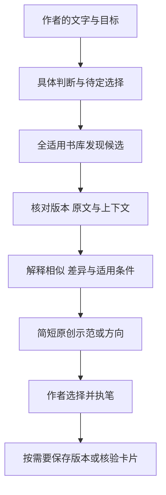

# 设计说明

## 核心目标

让作者完成眼前的作品，同时逐渐形成自己的表达判断。好的反馈既要指出问题，也要解释它如何影响读者、有哪些可选处理，以及作者为什么可能选择保留原写法。

默认协作以质疑、共同构思、依据和引导为主。作者明确要求时可以提供示范或候选稿。不是每次对话都需要上课：简单校对、系统维护和资料导入各有自己的范围。

## 四类数据分开

| 层 | 内容 | 更新原则 |
|---|---|---|
| Skill 规则 | 如何反馈、查书、教学、保存 | 根据真实需求与问题迭代 |
| 资料库 | 原文件、Markdown、来源记录、核验卡片 | 保留版本、覆盖范围与证据 |
| 作品 | 原稿、候选稿、活动稿、定稿 | 生成不等于采纳，不覆盖原稿 |
| 状态 | 明确的长期偏好与可恢复进度 | 观察与确认分开，不复制无关聊天 |

安装规则不会自动迁移书库；公开发布规则也不等于公开私人数据。模板只提供结构，不冒充既有进度。

## 按需加载

`SKILL.md` 留下核心约定和导航。`dialogue.md` 管反馈，`teaching.md` 管练习，`voice.md` 管风格，`retrieval.md` 管检索引用，`library.md` 管资料与卡片，`workspace.md` 管保存和版本。

助手先识别本次任务，再读取对应规则和材料。建设蓝图、下载报告和维护历史不进入日常写作辅导的默认上下文。

## 从问题到依据

这张图说明职责关系，不要求每次回复机械地走完所有步骤。已有有效阅读卡可用于复用指导；寻找新文学范例时仍面向整个适用书库，避免只围绕最近读过的作品。

## 可追溯而有限的检索

检索脚本将 Markdown 切成有重叠的小窗口，以字词检索和人工概念线索发现候选。搜索输出限制片段数量和字符预算，原文展开校验哈希。行号是 Markdown 行号，不是纸本页码。

阅读卡是对已经核验过的局部材料的分析，可在资料改变时识别失效。卡片命中不能证明整部作品已通读；字词共现也不能证明两个场景表达了同一种关系。

## 作者的决定权

提出问题时给出推荐及理由，一次只推进一个需要作者决定的问题。环境和原文能够查明的事实由助手核对。个人风格以真实样本和明确偏好为依据，不以通用“高级感”替换作者声音。
